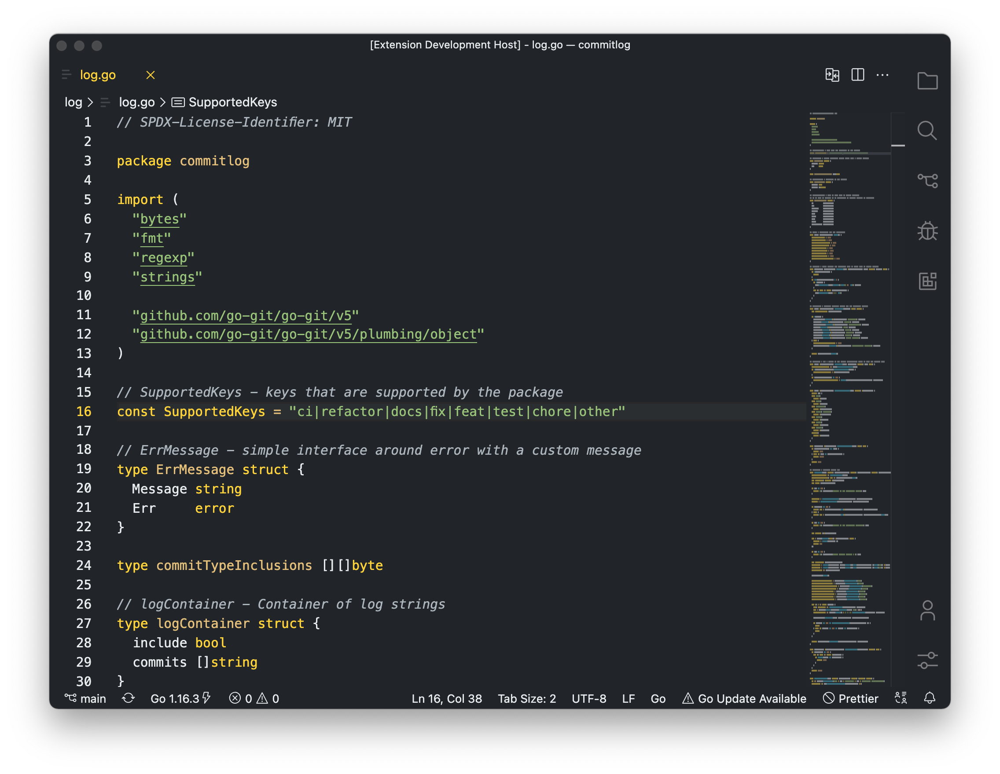

<p align="center">
     
</p>
<h1  align="center">Taco Syntax</h1>
<p align="center">
A Flat theme with the taco syntax theme
</p>

## Swatch

 


## Installation 
Look for `barelyreaper.taco-syntax` or just `Taco Syntax` on the the marketplace to install it.
[Taco Syntax](https://marketplace.visualstudio.com/items?itemName=barelyreaper.taco-syntax)

## Screenshots
<p align="center">
    
</p>

The screenshot above uses the following settings 
```jsonc
{
  "workbench.iconTheme": "quill-icons-minimal",
  "workbench.productIconTheme": "icons-carbon",
  "editor.renderIndentGuides": false,
  "editor.renderWhitespace": "none",
  "editor.minimap.renderCharacters": false,
  "workbench.colorTheme": "Taco Syntax",
  "workbench.startupEditor": "none",
  "workbench.sideBar.location": "right",

  // Font Settings
  "editor.fontLigatures": true,
  "terminal.integrated.fontFamily": "Menlo",
  "editor.fontSize": 13.5,
  "editor.fontFamily": "Menlo",
}
```
